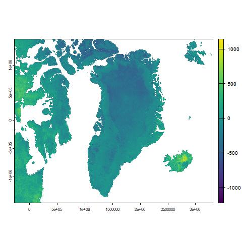

# Reporting multitemporal analysis in R
first of all, we should import am image by:

``` r
im.list() #male a list
gr=im.import("greenland") #to import the image
```

Then we might calculate the difference of values of two imgaes

``` r
grdif=gr[[4]]-gr[[1]]
```

This will create the following output jpeg image:


> with ">" you can write notes

>to separate two notes you have to leave an empty line

>here are the [sentinel data used](https://www.geocorsi.it/N1361/copernicus-data-space-ecosystem-accesso-libero-ai-dati-satellitari-sentinel.html)
